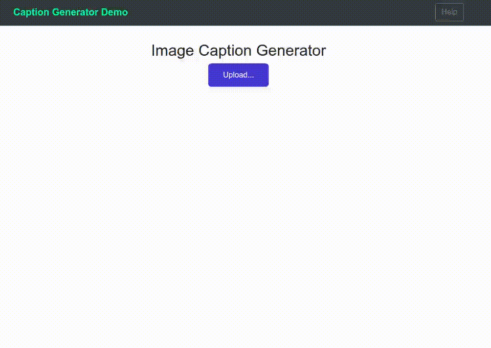
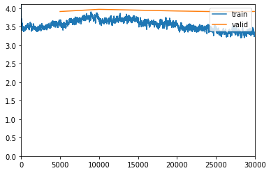
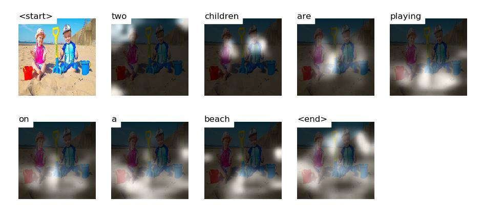

# Image captioning: Implementation of **Show, Attend and Tell** paper

- [Image captioning: Implementation of **Show, Attend and Tell** paper](#image-captioning-implementation-of-show-attend-and-tell-paper)
  - [Demo](#demo)
  - [Dataset Description](#dataset-description)
  - [Input files preparation](#input-files-preparation)
    - [1. preparation of vocabulary dictionary.](#1-preparation-of-vocabulary-dictionary)
    - [2. Create Dataset class](#2-create-dataset-class)
    - [3. Create Dataloader object](#3-create-dataloader-object)
    - [4. Create Pad_collete function](#4-create-pad_collete-function)
  - [Model architecture](#model-architecture)
    - [Encoder](#encoder)
    - [Attention Layer](#attention-layer)
    - [Decoder](#decoder)
      - [Model architecture dimensions](#model-architecture-dimensions)
  - [Training (Fastai Implementation)](#training-fastai-implementation)
    - [Fastai utilities](#fastai-utilities)
    - [Training in Stages](#training-in-stages)
    - [Model intrpretation](#model-intrpretation)
  - [Technology used](#technology-used)


## Demo



## Dataset Description

https://www.kaggle.com/ming666/flicker8k-dataset

**Flickr8k** Dataset consisting of around 8,000 images that are each paired with five different captions which provide clear descriptions of the salient entities and events. The images were chosen from six different Flickr groups, and tend not to contain any well-known people or locations, but were manually selected to depict a variety of scenes and situations. 6000 are used for training, 1000 for test and 1000 for development.


## Input files preparation

### 1. preparation of vocabulary dictionary.

The caption labels needs to be converted into numbers as a network does not accept strings as labels. we need a look-up dictionary and store word to numeric mappings in it. 

Along with it, caption lengths are also computed. Caption lengths are used for optimizing training (discussed in detail in the training part).


### 2. Create Dataset class

In PyTorch, for Deep learning tasks, inputs are fed in batches because of memory constraints. To facilitate this we should create a class called **Dataset** that facilitates batch creation and loading.

The primary function of Dataset is stores the input paths. This class will be used by Pytorch's *DataLoader()* for loading images in batches.

### 3. Create Dataloader object

The purpose of the **Dataloader** is to load a batch of inputs and labels pairs to be fed into the network.

It is always a good idea to sort by order of captions length for faster computation. On validation set, **SortSampler** funtion from *Fastai* is used which is built on top of PyTorch's **Sampler**. On the training set, **SortishSampler** that sorts data by order of length with a bit of randomness is used. The sampler return iterator of indices.


### 4. Create Pad_collete function
Since the captions lengths are of different lengths, padding should be added for shorter captions to bring them to same length as PyTorch expects caption lengths to be of the same size. 

Funtion collect samples and return labels tensor with padding. This funtion is passed as an argment( ```collate_fn``` ) while creating ```DataLoader``` object.

## Model architecture

The network architecture consists of three components i.e encoder, Attention, and decoder. 

### Encoder

The encoder is a convolution neural network that takes in raw images as input and outputs extracted features as encoded images. The extractor produces **L** (no of output convolution layers) vectors each of **D**-dimension (no of pixels) corresponds to part of the image thus indicates **L** different features at different locations have been identified.

For the encoder part, I have used **Resnet-101** architecture pre-trained on **Imagenet**. Since Resnet is trained for classifying different objects last Linear layer outputs 1-d prbability tensor. But, our objective is to get feature images so we have to retain only convolution layers and drop the last feed-forward layers.

### Attention Layer

The attention model generates attention weights at every step based on previous step (**h[t-1]**) hidden state vector it receives from decoder. Hidden state carries information about context the caption that has been generated so far.  

### Decoder

The decoder is the one that generates captions (one word at a step) has LSTM network architecture. The decoder takes attention weighted hidden state which is an improvised version of decoder hidden state at step **t-1** that tells which part of the image should be focused to generate the next word.

The flow is depicted in the following image:


#### Model architecture dimensions
```py
embedding input dimension = 300 
attention dimension = 512
decoder dimension = 512
decoder dropout = 0.5
encoder output dimension = 2048
```


## Training (Fastai Implementation)

As we are using pre-trained weights for the encoder which has been trained on the Imagenet dataset consisting of images of 1000's of different objects, that most likely includes objects found in our dataset. Therefore, the network need not require much of tuning. On the other hand, the decoder has to learn a lot as it starts language modeling from scratch.

So, it is better to train just decoder part (fine_tune off) for the first few epochs until we bring both of them to the same level then train the entire network for the next few epochs. In this way, we can save computational time involved in encoder's gradient computation while the decoder takes most of the updation in the initial few epochs.

Training decoder from scratch requires a lot of computation hence more time. Instead, we can use pre-trained word embeddings (word represent as a numeric vector) to train embedding layer output of which is passed into decoder along with the previous hidden state.


### Fastai utilities

Fastai is deep learning framework built on top of PyTorch with implementation of variuos state of the art methods. It provides a smooth API making it easier for most important deep learning applications. 

* **lr _finder** - It will do a mock training by going over a large range of learning rates, then plot them against the losses. We will pick a value a bit before the minimum, where the loss still improves.


* **fit_one_cycle** - Method is implementation of one cycle policy. lr goes up to max and comes down for one cycle of passing through all mini-batches. In one fit cycle takes entire input and divides into batches of size 'bs'. then start with lr_min for the first batch increase gradually for next batches and when the batch number reaches 30 percent of total batches, lr reaches lr_max and then starts going down and reaches lr_min again at last batch.

    The original 1cycle policy has three steps:

    1. We progressively increase our learning rate from lr_max/div_factor to lr_max and at the same time, we progressively decrease our momentum from mom_max to mom_min.
    2. We do the exact opposite: we progressively decrease our learning rate from lr_max to lr_max/div_factor and at the same time, we progressively increase our momentum from mom_min to mom_max.
    3. We further decrease our learning rate from lr_max/div_factor to lr_max/(div_factor x 100) and we keep momentum steady at mom_max.


**Clipping gradients**:
*  Gradients can vanish because they are continuously multiplied by numbers less than one. This is called the vanishing gradient problem.

* It has little effect on learning, but if you have a "bad minibatch" that would cause gradients to explode for some reason, the clipping prevents that iteration from messing up your entire model.

**Early Stopping**

* The authors of *Show, Attend and Tell paper* observe that correlation between the loss and the BLEU score breaks down after a point, so they recommend to stop training early on when the BLEU score starts degrading or stops improving.

### Training in Stages

In the first stage, the model is trained with encoder part froze i.e only decoder weights allowed to be updated for faster training. The model was run with a batch of ```25``` images for 12 epochs using ```Adam()``` optimizer with a learning rate of ```4e-04```

**Results**:
epoch | train_loss | valid_loss | topK_accuracy | bleu_metric | time
------|------------|------------|---------------|-------------|-----
0 | 5.214312 | 5.114823 | 50.198002 | 0.081026 | 24:28
1 | 4.716277 | 4.613837 | 57.626312 | 0.092200 | 25:45
2 | 4.415894 | 4.416328 | 60.937576 | 0.123413 | 21:50
3 | 4.334466 | 4.338488 | 62.068180 | 0.129544 | 24:07
4 | 4.400496 | 4.324118 | 62.645420 | 0.136505 | 17:36
5 | 4.434565 | 4.332970 | 62.816364 | 0.134549 | 18:21
6 | 4.338492 | 4.312871 | 63.011261 | 0.138030 | 18:16
7 | 4.312972 | 4.354464 | 62.979424 | 0.139692 | 17:59
8 | 4.245957 | 4.367558 | 62.798244 | 0.143513 | 40:14
9 | 4.217909 | 4.391149 | 62.631451 | 0.145690 | 46:22
10 | 4.263050 | 4.395726 | 62.272305 | 0.151511 | 48:45
11 | 4.231505 | 4.405222 | 62.154373 | 0.151981 | 48:58


In the second stage, the model is trained with the encoder part unfrozen condition. The model was run with batch of ```5``` images for 10 epochs using ```Adam()``` optimizer with ```1e-04``` learning rate adopting  ```one cycle policy``

**Results**:

epoch | train_loss | valid_loss | topK_accuracy | bleu_metric | time
------|------------|------------|---------------|-------------|-----
0 | 3.810483 | 4.088752 | 67.392433 | 0.151205 | 54:51
1 | 3.801625 | 4.089584 | 67.503128 | 0.153055 | 46:48
2 | 3.741014 | 4.085797 | 67.582474 | 0.149824 | 49:30
3 | 3.793046 | 4.076271 | 67.703247 | 0.149450 | 43:24
4 | 3.850789 | 4.071469 | 67.875778 | 0.150353 | 41:40
5 | 3.727266 | 4.071663 | 67.827240 | 0.154131 | 41:40
6 | 3.657987 | 4.068090 | 67.793610 | 0.152747 | 41:40
7 | 3.666413 | 4.070165 | 67.878853 | 0.151366 | 41:40
8 | 3.738047 | 4.064260 | 67.953964 | 0.151926 | 41:41
9 | 3.693643 | 4.072398 | 67.859917 | 0.151851 | 41:42




**Evaluation Beam search**

**Beam search**: Involves selecting words with top ```k```(beam width) scores rather than a word with the best score at each step. Beam Search is useful for any language modeling problem because it finds the most optimal sequence.


**Validation results**

Beam Size | Test BLEU-4
----------|-------------
1 |  21.8
3 |  23.46
5 |  23.9


### Model intrpretation




## Technology used


[](https://pytorch.org/)
[](https://www.fast.ai/)
[](https://flask.palletsprojects.com/en/1.1.x/) 
[]()
[](https://jquery.com/)


**Credits:**

1. [Show, Attend and Tell - paper (arxiv)](https://arxiv.org/abs/1502.03044)

2. [Illustrated Guide to LSTM's and GRU's - Medium](https://towardsdatascience.com/illustrated-guide-to-lstms-and-gru-s-a-step-by-step-explanation-44e9eb85bf21) 

2. [a-PyTorch-Tutorial-to-Image-Captioning - GitHub](https://github.com/sgrvinod/a-PyTorch-Tutorial-to-Image-Captioning)