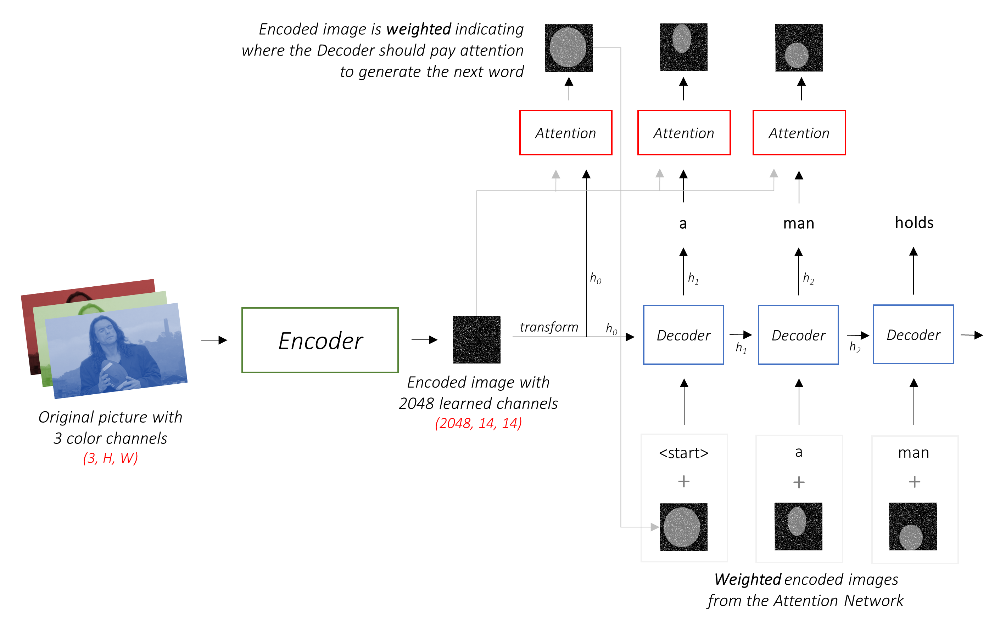
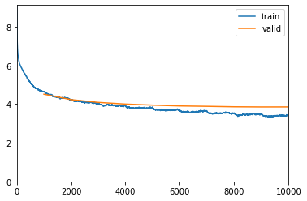

# Image captioning: Implementation of ***Show, Attend and Tell*** paper


## Requirements
- **Dataset** - [Flicker8k]('https://www.kaggle.com/ming666/flicker8k-dataset') or any dataset of your choice
- **Modules** - Pytorch, NumPy, Pandas, Nltk, etc.
- **Concepts** - Encoder-Decoder, Resnet pre-trained model, Attention, Transfer learning, Bleu4, Beam Search.
- Pretrained word embeddings (optional) - training much faster with pre-trained word embeddings. 


## 1. **Input files preparation**

The input data consists of a collection of raw images and metadata that has caption labels for every image in *JSON* format.

There are Multiple captions available for each image. however, for simplicity, I have considered up to 5 captions for each image.

### preparation of vocabulary dictionary.

It is necessary to convert the captions into numbers as a network does not accept strings as labels. we need to create a look-up dictionary that maps between word and index. All the caption labels are tokenized and a number is assigned for each unique word known as **numericalization**. 

Along with it, caption lengths are also computed. Caption lengths are used for optimizing training (discussed in detail in the training part).


### Create Dataset class
 In PyTorch, for Deep learning tasks, inputs are fed in batches because of memory constraints. To facilitate this we need to create a class called **Dataset** that helps us in creating and loading batches.

The primary function of Dataset is stores the input paths and loads them when indexed 
 This class will be used by Pytorch's *DataLoader()* for loading batches.

### Create Dataloader object

The purpose of the **Dataloader** is to load a batch of inputs and labels to be fed into the network.

It is always a good idea to sort by order of captions length for faster computation. On validation set, **SortSampler** from *Fastai* is used which is built on top of PyTorch's **Sampler**. On the training set, **SortishSampler** that sorts data by order of length with a bit of randomness is used. The sampler return iterator of indices.


### Create Pad_collete function
Since the captions lengths are of different lengths, padding should be added for shorter captions to bring them to common shape as PyTorch expects caption lengths to be of the same size. 

Funtion collect samples and return labels tensor with padding. This funtion is passed as an argment( ```collate_fn``` ) while creating ```DataLoader``` object.

## 3. **Model architecture**
The network architecture consists of three components i.e encoder, Attention, and decoder. 

### Encoder
The encoder is a convolution neural network that takes in raw images as input and outputs extracted features as encoded images. The extractor produces **L** (no of output convolution layers) vectors each of **D**-dimension (no of pixels) corresponds to part of the image thus indicates **L** different features at different locations have been identified.

.

## Attention Model

The attention model generates attention weights at each step based on hidden state (**h[t-i]**) it received from decoder output at the previous step. 


each **a** is weight vectors focus on different parts of the image thus at weights concentrated at different locations.

Notice that **Z(t)** and **h(t-1)** should be of the same size as both going be combined (through one to one mapping functions) while in Attention and decoding process but original size doesn't match as both come from different sources so we have to use Linearlayer to reduce to a common size.

for each location **i**, mechanism **Z(t)** generates a positive weights **α(i)** which is probabilty number that tells amount of focus to put on that part (**i**)  for generating **t** word in the caption (*hard attention*) or as relative importance to give to **i** location blend **a(i)**'s together in different proportion **α(i)**'s (*soft attention*).

Attention is a multi-layer perceptron conditioned on previous hidden state **h(t-1)**  that encodes the sequence of words already predicted by decoder LSTM.


**α(ti)** defines attention given to each of **i** locations at time step **t** and **h(t-1)** encodes context till **t-1** steps tell not to give much focus on a location that has already read previously to avoid repetition of words in the caption.

Once the weights are computed context vector **z(t)** is computed by


**Z(t)** transformation function outputs vector that forms one of the inputs into the decoder.

This **Z(t)** is different for Hard and Soft attention. I won't touch Mathematics behind them here. However, interested readers can refer to *section 4* in the [paper](https://arxiv.org/pdf/1502.03044.pdf). I have implemented soft attention.

### Decoder

The decoder is the one that generates captions has LSTM network architecture. The decoder takes previous step attention weighted hidden state which is an improvised version of decoder hidden state 
**h(t-1)** telling which part of the image to focus on to generate the next word.

Atten of **a** lets call the transformation function **Z(t)** where **t** current step indication transformation is different at every time step and word embedding matrix **E** which forms vocabulary for caption generation. 

### Zoom into Attention part.

1. Encoder outputs tensor of size batch size, image size, image size, encoder dim (1, 14, 14, 2048). Since decoder **hidden state** is of size decoder_dim (512). we have to reduce them to common size using a fully connected layer to (1, 14,14, 512). 

2. hidden encoder taken dot product across image pixels producing attention activation layer (14, 14). The hidden encoder decides where to put the focus on the image to generate words based on previously generated words.

3. Now we use this attention layer to compute weighted sum across the pixels dimension of encoder output tensor producing a vector of size (512) encodes what is interesting for it. This vector is called attention weighted hidden state.

4. Sigmoid scores, computed on these Attention weighted hidden state, has to be multiplied to the Decoder hidden state before passing into Decoder network to generate the next word.

The flow is depicted in the following image:


## Model Building

### initialize model

For the encoder part, I have used **Resnet-101** architecture trained on **Imagenet**. Since the resent was built for classifying different objects final layer outputs 1-d tensor. But, our objective is to get feature images so we have to retain only convolution layers and drop the last feed-forward layers. 

There is an option to turn off encoder  fine_tuning, This sets ```requires_grad``` attribute of Encoder parameters to false.

Note: for the Encoder, As we are using pre-trained weights trained on the Imagenet dataset consisting of images of 1000's of different objects which most likely includes objects found in our dataset. Therefore, the network doesn't need much tuning. On the other hand, the decoder has to learn a lot as it starts language modeling from scratch.

It is better to train just decoder part (fine_tune off) for the first few epochs until we bring both of them to the same level then train the entire network for the next few epochs. In this way, we can save computational time involved in encoder's gradient computation when the decoder takes most of it in the initial few epochs.

Training decoder from scratch requires a lot of computation hence more time. Instead, we can use pre-trained word embeddings (word represent as a numeric vector) to train embedding layer output of which is passed into decoder along with the previous hidden state.

### Training (Fastai Implementation)
* **lr _finder** - It will do a mock training by going over a large range of learning rates, then plot them against the losses. We will pick a value a bit before the minimum, where the loss still improves.

* **fit_one_cycle** - Method is implementation of one cycle policy. lr goes up to max and comes down for one cycle of passing through all mini-batches. In one fit cycle takes entire input and divides into batches of size 'bs'. then start with lr_min for the first batch increase gradually for next batches and when the batch number reaches 30 percent of total batches, lr reaches lr_max and then starts going down and reaches lr_min again at last batch.

    The original 1cycle policy has three steps:

    1. We progressively increase our learning rate from lr_max/div_factor to lr_max and at the same time, we progressively decrease our momentum from mom_max to mom_min.
    2. We do the exact opposite: we progressively decrease our learning rate from lr_max to lr_max/div_factor and at the same time, we progressively increase our momentum from mom_min to mom_max.
    3. We further decrease our learning rate from lr_max/div_factor to lr_max/(div_factor x 100) and we keep momentum steady at mom_max.


Training imp points:
1. Note that there is considerable criticism of the BLEU score because it doesn't always correlate well with human judgment. The authors also report the METEOR scores for this reason, but I haven't implemented this metric.

2. Instead of training word embedding layer from scratch a widely used *Glove* pre-trained word embedding was used for faster training and also a Language model trained on Wikipedia called *wiki-103* as a starting point for Decoder training.


### Callback Utilities:

**Teacher forcing** 
* teacher forcing is whispering actual word as input into decoder instead of previous predict word with some randomness

**Clipping gradients**:
*  Gradients can vanish because they are continuously multiplied by numbers less than one. This is called the vanishing gradient problem.

* It has little effect on learning, but if you have a "bad minibatch" that would cause gradients to explode for some reason, the clipping prevents that iteration from messing up your entire model.

**Early Stopping**

* The authors of *Show, Attend and Tell paper* observe that correlation between the loss and the BLEU score breaks down after a point, so they recommend to stop training early on when the BLEU score starts degrading or stops improving.

### Training in Stages

In the first stage, the model is trained with encoder part froze i.e only decoder weights allowed to be updated for faster training. The model was run with a batch of ```25``` images for 12 epochs using ```Adam()``` optimizer with a learning rate of ```4e-04```

**Results**:
epoch | train_loss | valid_loss | topK_accuracy | bleu_metric | time
------|------------|------------|---------------|-------------|-----
0 | 5.214312 | 5.114823 | 50.198002 | 0.081026 | 24:28
1 | 4.716277 | 4.613837 | 57.626312 | 0.092200 | 25:45
2 | 4.415894 | 4.416328 | 60.937576 | 0.123413 | 21:50
3 | 4.334466 | 4.338488 | 62.068180 | 0.129544 | 24:07
4 | 4.400496 | 4.324118 | 62.645420 | 0.136505 | 17:36
5 | 4.434565 | 4.332970 | 62.816364 | 0.134549 | 18:21
6 | 4.338492 | 4.312871 | 63.011261 | 0.138030 | 18:16
7 | 4.312972 | 4.354464 | 62.979424 | 0.139692 | 17:59
8 | 4.245957 | 4.367558 | 62.798244 | 0.143513 | 40:14
9 | 4.217909 | 4.391149 | 62.631451 | 0.145690 | 46:22
10 | 4.263050 | 4.395726 | 62.272305 | 0.151511 | 48:45
11 | 4.231505 | 4.405222 | 62.154373 | 0.151981 | 48:58




In the second stage, the model is trained with the encoder part unfrozen condition. The model was run with batch of ```5``` images for 10 epochs using ```Adam()``` optimizer with ```1e-04``` learning rate adopting  ```one cycle policy``

**Results**:

epoch | train_loss | valid_loss | topK_accuracy | bleu_metric | time
------|------------|------------|---------------|-------------|-----
0 | 3.810483 | 4.088752 | 67.392433 | 0.151205 | 54:51
1 | 3.801625 | 4.089584 | 67.503128 | 0.153055 | 46:48
2 | 3.741014 | 4.085797 | 67.582474 | 0.149824 | 49:30
3 | 3.793046 | 4.076271 | 67.703247 | 0.149450 | 43:24
4 | 3.850789 | 4.071469 | 67.875778 | 0.150353 | 41:40
5 | 3.727266 | 4.071663 | 67.827240 | 0.154131 | 41:40
6 | 3.657987 | 4.068090 | 67.793610 | 0.152747 | 41:40
7 | 3.666413 | 4.070165 | 67.878853 | 0.151366 | 41:40
8 | 3.738047 | 4.064260 | 67.953964 | 0.151926 | 41:41
9 | 3.693643 | 4.072398 | 67.859917 | 0.151851 | 41:42


**Evaluation Beam search**

**Beam search**: Involves selecting words with top ```k```(beam width) scores rather than a word with the best score at each step. Beam Search is useful for any language modeling problem because it finds the most optimal sequence.


### Export Model

``` python
torch.save('bestmodel_stage2.pkl')
```


External links:

1. [Show, Attend and Tell - paper (arxiv)](https://arxiv.org/abs/1502.03044)

2. [Illustrated Guide to LSTM's and GRU's - Medium](https://towardsdatascience.com/illustrated-guide-to-lstms-and-gru-s-a-step-by-step-explanation-44e9eb85bf21) 

2. [a-PyTorch-Tutorial-to-Image-Captioning - GitHub](https://github.com/sgrvinod/a-PyTorch-Tutorial-to-Image-Captioning)